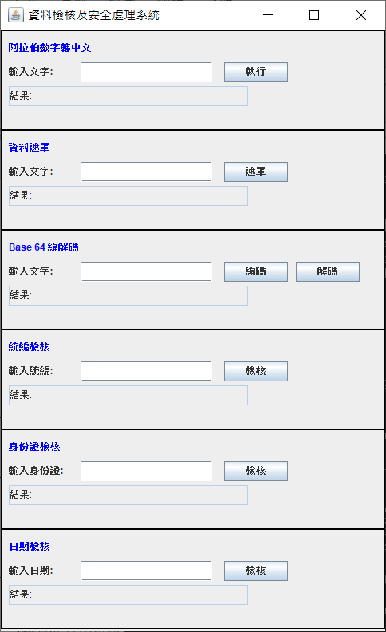
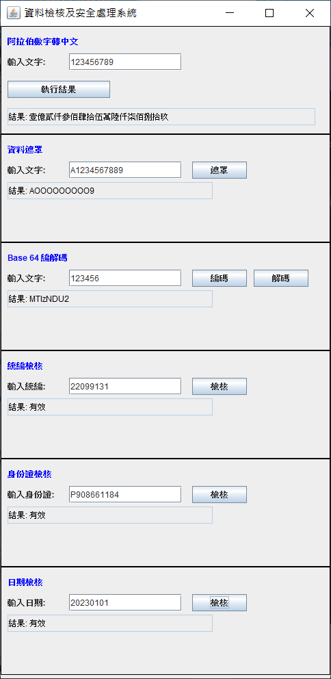

# 資料檢核及安全處理模組

## 公共程式描述
資料檢核及安全處理模組主要提供多樣的數據檢核與處理功能，包括敏感資料遮罩、資料編碼/解碼、以及檢核驗證功能，從而有效保障資料的正確性與安全性。該模組不僅可以幫助系統進行資料格式檢查，還能進行資料的轉換與安全處理，適用於資料處理、傳輸與保護等場景。

### 解決方案
- 解決了後端資料處理中的準確性與安全性問題，有效確保資料的正確性與一致性，並同時達到強化資料安全的目的。

### 核心功能：
1. **敏感資料遮罩處理**：針對姓名、身分證號等敏感資料進行遮罩，保護個人隱私。
2. **數值與日期轉換工具**：提供靈活的數值和日期格式轉換功能，支援數字轉中文及其他資料格式處理。
3. **資料檢核功能**：包括身分證、統一編號、日期格式等多種檢核工具，確保數據格式的正確性。

---

## 1. 所用技術
- Java 8
- Maven 3.6.3

## 2. 安裝指南
> 請確保您的環境中安裝有 Java 8 及 Maven 3.6.3 以上版本。

```bash
# 執行步驟
git clone https://gitlab.iisigroup.com/ps150/g-p231301/modapc/textMaskUtils.git
cd textMaskUtils
mvn clean package
java -jar target/TextMaskUtils-1.0-SNAPSHOT.jar
```

## 3. 使用情境範例

### 1. **敏感資料遮罩處理**
- 系統針對用戶姓名進行遮罩處理。調用 `TextMaskUtils.mask` 方法，可實現姓名遮罩，例如「王小明」顯示為「王O明」。
  
```java
// 調用 TextMaskUtils.mask 方法
String maskedName = TextMaskUtils.mask("王小明");
// 返回結果：王O明
```
### 2. **Base64 編碼與解碼功能**
- 使用該功能對字串或圖片進行 Base64 編碼與解碼，方便資料的轉換與傳輸。

#### 字串到 Base64 編碼範例

```java
// 字串到 Base64 編碼
String encoded = Base64Utils.encodeToString("Hello World".getBytes());
// 返回結果：SGVsbG8gV29ybGQ=
```

### 3. **數值與日期格式轉換**
- 系統提供靈活的日期和數值轉換工具，確保資料格式的一致性和靈活性。

#### 日期格式轉換範例

```java
// 日期格式轉換
String formattedDate = DateUtils.format("2023-10-22", "yyyy-MM-dd", "dd/MM/yyyy");
// 返回結果：22/10/2023
```


## 4. 結果展示

- 執行前



- 執行後



## License
For open source projects, say how it is licensed.
本專案採用 CC0 1.0 Universal (CC0 1.0) 公共領域貢獻 授權條款。詳細授權內容請參閱 LICENSE 文件。
